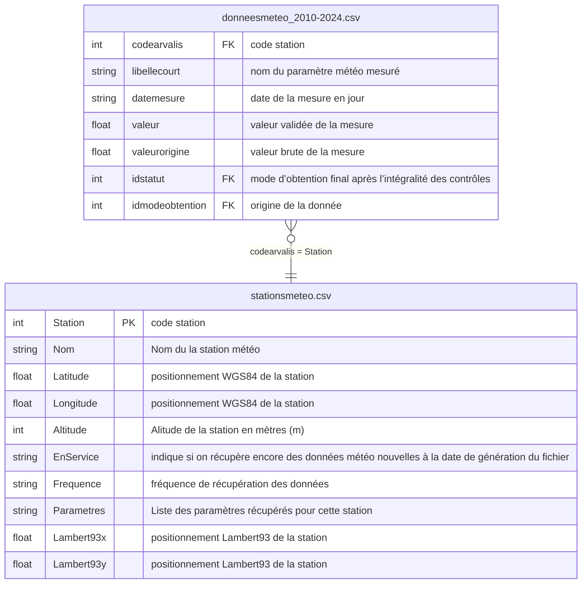

```mermaid
erDiagram
    "donneesmeteo_2010-2024.csv" {
        int codearvalis FK "code station"
        string libellecourt "nom du paramètre météo mesuré"
        string datemesure "date de la mesure en jour"
        float valeur "valeur validée de la mesure"
        float valeurorigine "valeur brute de la mesure"
        int idstatut FK " mode d’obtention final après l’intégralité des contrôles"
        int idmodeobtention FK "origine de la donnée"
    }
    "stationsmeteo.csv" {
        int Station PK "code station"
        string Nom "Nom du la station météo"
        float Latitude "positionnement WGS84 de la station"
        float Longitude "positionnement WGS84 de la station"
        int Altitude "Alitude de la station en mètres (m)"
        string EnService "indique si on récupère encore des données météo nouvelles à la date de génération du fichier"
        string Frequence "fréquence de récupération des données"
        string Parametres "Liste des paramètres récupérés pour cette station"
        float Lambert93x "positionnement Lambert93 de la station"
        float Lambert93y "positionnement Lambert93 de la station"
    }
    "donneesmeteo_2010-2024.csv" }o--|| "stationsmeteo.csv" : "codearvalis = Station"
```